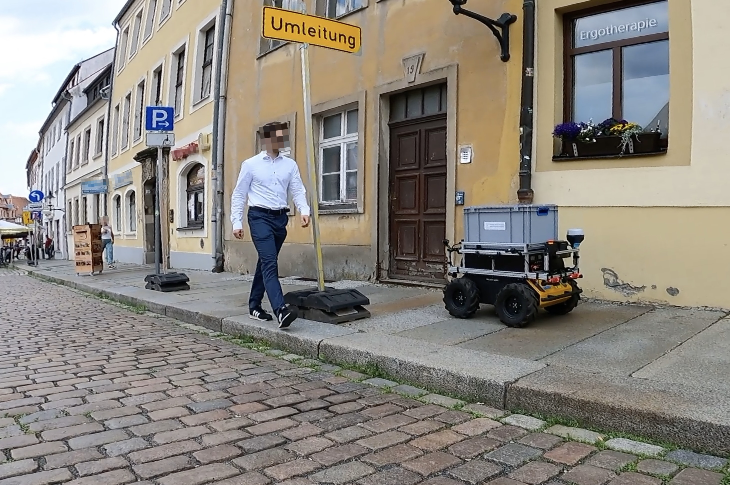
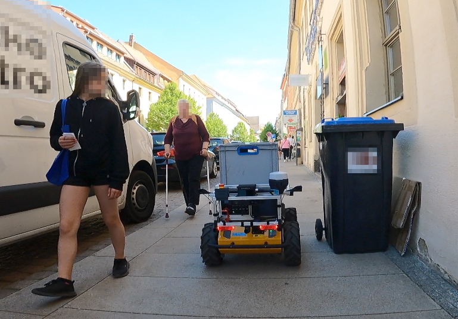
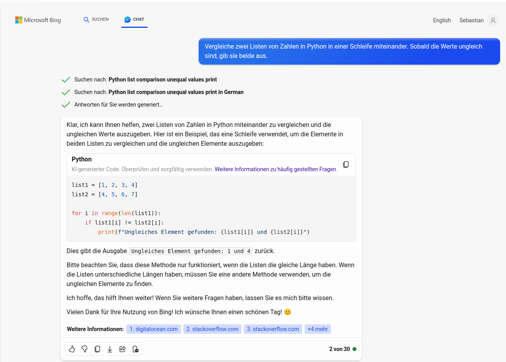
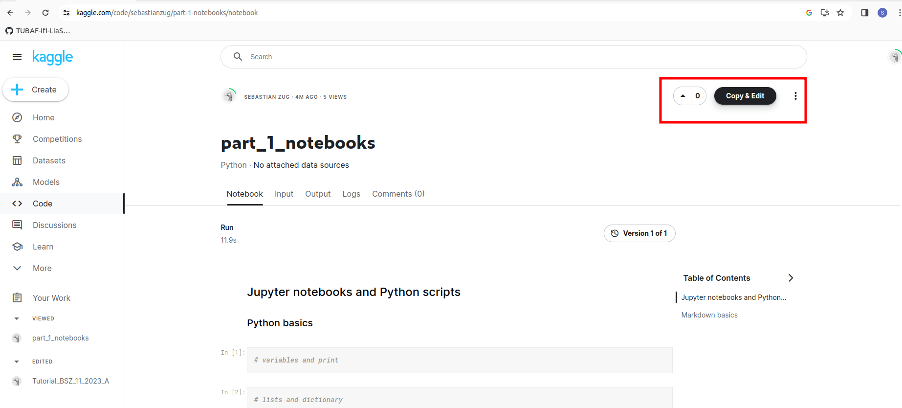
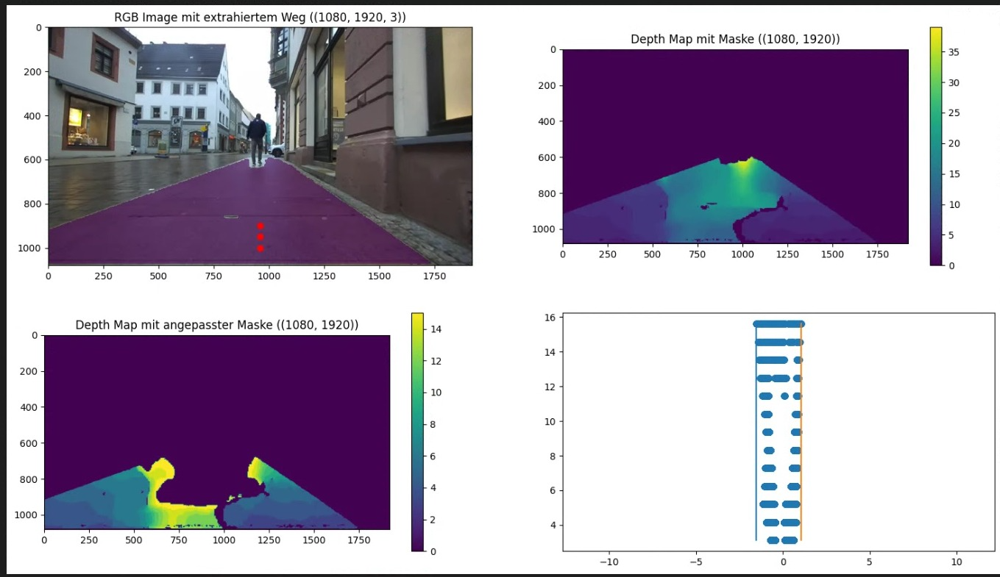

<!--
author:   Sebastian Zug

email:    LiaScript@web.de

version:  0.0.3

language: en

narrator: US English Female

import: https://raw.githubusercontent.com/LiaScript/CodeRunner/master/README.md

-->

[](https://liascript.github.io/course/?https://raw.githubusercontent.com/SebastianZug/ImageProcessing_2023/main/README.md)

# Python Einführung Bildverarbeitung - 30. November 2023

+ Matthias Saurbier (Berufsschulzentrum "Julius Weisbach")
+ Sebastian Zug (TU Bergakademie Freiberg)

------------------------------------------------------------

```python main.py   
print("Welcome to the course!")
```
@LIA.eval(`["main.py"]`, `none`, `python3 main.py`)


## Organisation des Tages

__Agenda of this day__

| Slot          | Topic                                                  |
| ------------- | ------------------------------------------------------ |
| 07:30 - 08:00 | Teil 1: Theoretische Grundlagen, Nutzung von Notebooks |
| 08:00 - 09:00 | Teil 2: Elemente der Bildverarbeitung                  |
| 09:00 - 09:15 | Pause                                                  |
| 09:15 - 10:45 | Teil 3: Bildverarbeitung mit opencv                    |


### Hintergründe und Erwartungen

                     {{0-1}}
***************************************************************

Wer bin ich?
---------------

+ Studium des Maschinenbaus / Promotion an der Otto-von-Guericke Universität Magdeburg
+ Prof. für Softwareentwicklung an der Technische Universität Freiberg seit 2018

Aktuelle Forschungsarbeiten betreffen die Entwicklung von Methoden zur Kartenerstellung für die Planung von autonomen Fahrzeugen.





_Eindrücke vom Projekt __RobotTraces__ der Hochschule Schmalkalden und der Technischen Universität Freiberg_

***************************************************************

                     {{1-2}}
***************************************************************

Was ist Ihr Hintergrund?
--------------------

Was sind Ihre Erwartungen an den heutigen Tag?

Welche Programmierkenntnisse haben Sie?

***************************************************************

### Warm up

> __Aufgabe:__ Vergleichen Sie zwei Listen mit Zahlenwerte mit einem Python-Skript. Geben Sie die Zahlenpaar aus, die unterschiedlich sind. Fügen Sie Ihre Lösung direkt hier in das Skript ein.

```python Solution.py
# List definition
my_list_A = [1, 2, 3, 4, 5, 6]
my_list_B = [1, 2, 5, 4, 8, 6]

# Compare lists
# ??
print("Hier fehlt Ihre Lösung :-)")  
```
@LIA.eval(`["main.py"]`, `none`, `python3 main.py`)

> __Hinweis:__ Nutzen Sie [ChatGPT](https://www.bing.com/search?q=Bing+AI&showconv=1&FORM=hpcodx) oder eine andere KI um die Codeentwicklung zu beschleunigen. 
> 
> 

## Session 1 - Jupyter Notebooks vs. Python Scripts 

> Was ist die generelle Idee des Codebeispiels oben?

1. Schreibe den Code
2. Starte den Python Interpreter und führe den gesamten Code aus

__Python-Skripte__ sind ideal für die Automatisierung, Integration und Bereitstellung, da sie portabel, flexibel und leicht zu pflegen sind. Sie werden linear und von oben nach unten ausgeführt. Die Ausgabe wird im Terminal oder auf der Konsole angezeigt. Der Code wird als einfache Textdateien (`.py`) weitergegeben.

{{1}}
Auf der anderen Seite führen __Jupyter Notebooks__ auch Python-Code aus. Sie sind jedoch ideal für die Erforschung und Visualisierung von Daten, da sie interaktiv sind und Rich Media unterstützen. Sie bestehen aus mehreren Zellen, die entweder einen Block mit Python-Code oder einfachen Text enthalten können. Die Zellen können in beliebiger Reihenfolge ausgeführt werden. Die Ausgabe wird im Notebook angezeigt. Der Code wird in Form von notebook-Dateien (`.ipynb`) weitergegeben.

### Ausprobieren!

> Fangen wir mit der praktischen Arbeit an!. Wir werden in einer webbasierten Entwicklungsumgebung arbeiten. Diese ist unter https://www.kaggle.com/ erreichbar. Bitte erstellen Sie sich einen Account und öffnen Sie das erste Notebook.

https://www.kaggle.com/sebastianzug/part-1-notebooks



### Summary

| **Feature**                        | **Python Scripts**                                                | **Jupyter Notebooks**                                                |
| ---------------------------------- | ----------------------------------------------------------------- | -------------------------------------------------------------------- |
| Dateierweiterung                   | `.py`                                                             | `.ipynb`                                                             |
| Texteditor                         | Jeder Texteditor oder IDE                                         | Nicht zum direkten Öffnen mit Texteditoren gedacht                   |
| Ausführung                         | Linear, von oben nach unten                                       | Zellen können in beliebiger Reihenfolge ausgeführt werden            |
| Ausgabeanzeige                     | Die Ausgabe wird im Terminal oder in der Konsole angezeigt        | Die Ausgabe wird im Notizbuch angezeigt                              |
| Codefreigabe                       | Code wird als einfache Textdateien freigegeben                    | Code wird als Notebookdateien freigegeben                            |
| Datenvisualisierung                | Nicht ideal für Datenvisualisierung                               | Ideal für Datenexploration und -visualisierung                       |
| Automatisierung und Bereitstellung | Eher geeignet für Automatisierung, Integration und Bereitstellung | Weniger geeignet für Automatisierung, Integration und Bereitstellung |

## Session 2 - Basics  

> Was heißt das eigentlich "image processing"?

_In der Informatik und Elektrotechnik ist die Bildverarbeitung die Verarbeitung von Signalen, die Bilder darstellen, z. B. Fotos oder Einzelbilder aus Videos. Das Ergebnis der Bildverarbeitung kann wiederum ein Bild oder ein Satz von Merkmalen des Eingangsbildes sein._ (Wikipedia)



Was ist eigentlich ein Bild aus Sicht des Computers?

```python ColoredImage.py
import numpy as np
import cv2
from matplotlib import pyplot as plt

# 3x3 matrix
red = np.array([[0, 255, 255],
                [0, 255, 0],
                [0, 255, 0]])

green = np.array([[0, 255, 0],
                  [0, 255, 0],
                  [0, 255, 255]])

blue = np.array([[255, 255, 0],
                   [0, 255, 0],
                   [0, 255, 0]])

rgb_image =  cv2.merge((blue, green, red))  # <-- What do you think about the order? BGR
#cv2.cvtColor(resized, cv2.COLOR_BGR2RGB)

resized = cv2.resize(rgb_image, (300,300), interpolation= cv2.INTER_NEAREST)
cv2.imwrite("filename.png", resized)
#plt.imshow(rgb_image)
```
@LIA.eval(`["main.py"]`, `none`, `python3 main.py`)


Ok, das ist jetzt doch sehr abstrakt. Können wir auch mal ein richtiges Bild sehen?

https://imagecolorpicker.com/

> An dieser Stelle schauen wir uns an, wie wir die Arrays in Python nutzen können, um Bilder zu manipulieren. Dazu nutzen wir die Bibliothek `numpy` und `matplotlib`. 

## Session 3 - Einführung in OpenCV

> Bislang haben wir alles "von Hand gemacht". Das ist natürlich nicht sehr effizient. Daher nutzen wir jetzt die Bibliothek `opencv` um die Bildverarbeitung zu beschleunigen. 

> _OpenCV (Open Source Computer Vision Library) ist eine Bibliothek mit Programmierfunktionen hauptsächlich für die Echtzeit-Computersicht. Ursprünglich von Intel entwickelt, wurde sie später von Willow Garage und dann von Itseez (das später von Intel übernommen wurde) unterstützt. Die Bibliothek ist plattformübergreifend und wird als freie und quelloffene Software unter der Apache License 2 lizenziert. Seit 2011 bietet OpenCV GPU-Beschleunigung für Echtzeitoperationen._ (Wikipedia)


```ascii
                    +----------------------+
                    | Preprocessing        |  Thresholding, Resizing, Smoothing, ...
                    +----------------------+
                               |              
                               v             
                    +----------------------+
                    | ....                 |  
                    +----------------------+
                               |                          
                               v
                    +----------------------+
                    | Feature extraction   |  Identification of obstacles, humans ...
                    +----------------------+
                               |
                               v
                    +----------------------+
                    | ....                 |  
                    +----------------------+
                               |
            +------------------+-----------------+
            |                                    |
            v                                    v
  +----------------------+            +----------------------+
  | Visualization        |            | Interpretation       |
  +----------------------+            +----------------------+
                                  
    2D, 3D, Features, ...               Counts, Distances ...                                                   

```

Die Bildverarbeitung kann in mehrere Schritte unterteilt werden. Der erste Schritt ist die Bildvorverarbeitung. Dieser Schritt umfasst die Bildverbesserung, die Rauschunterdrückung, die Bildsegmentierung und die Bildskalierung. Der zweite Schritt ist die Merkmalsextraktion. Dieser Schritt umfasst die Merkmalsextraktion, die Merkmalsselektion und die Merkmalsklassifizierung. Der dritte Schritt ist die Objekterkennung. Dieser Schritt umfasst die Objekterkennung, die Objektverfolgung, die Objektverfolgung und die Objektklassifizierung. Final werden dann entsprechende Visualisierungen und Interpretationen durchgeführt.

